## Post First Tutorial

### Recording
- Please find the recording for our first tutorial here: https://hkust.zoom.us/rec/share/wjhMjjOS3l1vZl0BRzk5SwqfWuL6wyOh9t7-QhMqLsq-WjBF2FGsSagit7S97VI0.pwuJf677ICOYu1ym 

### Requirements

- The purpose of our first tutorial is learning how to install software and packages that are needed for our future tutorial on your computer. This is the most important step to start with.

- Using git on command line is noe required but you should know how to use python and install packages in anaconda.

- Please read this document carefully, you can easily follow the steps here to successfully install the git and anaconda: https://github.com/HKUST-SOSC4300-5500/Tutorial-Material/blob/master/week1/0-week1.md 

### Check installations

- check whether you have installed the git and anaconda successfully:      
	+ 1) For Mac users:

		* a) Open spolight search, and type "terminal" on the search box
		  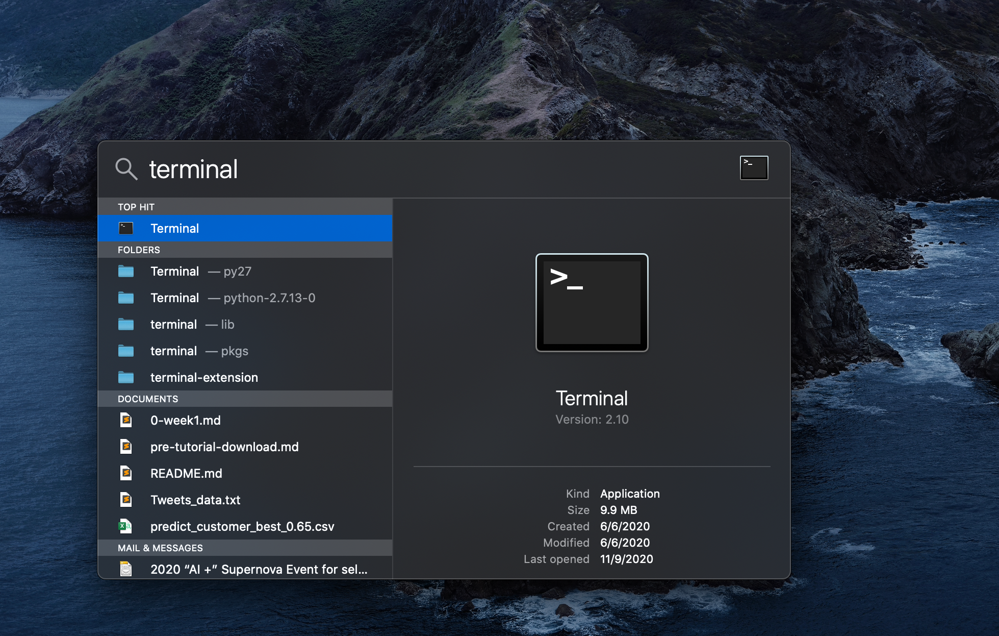
		* b) Open the terminal
		  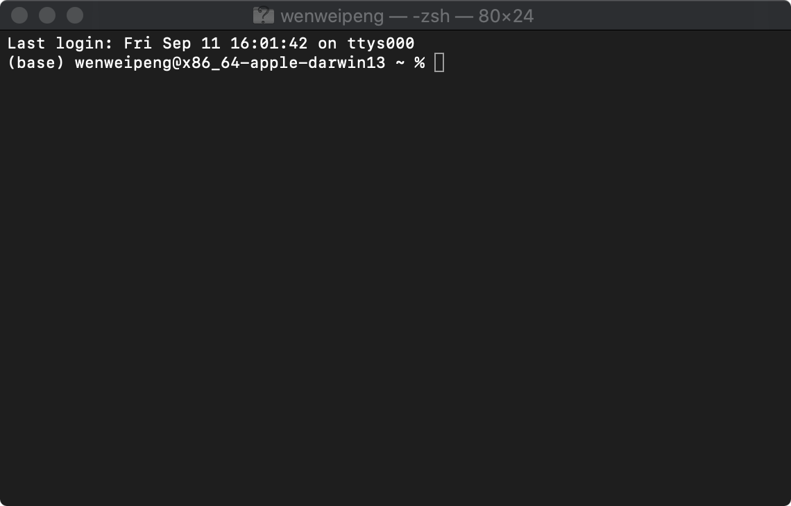
		* c) type "git", and hit enter/return key
		  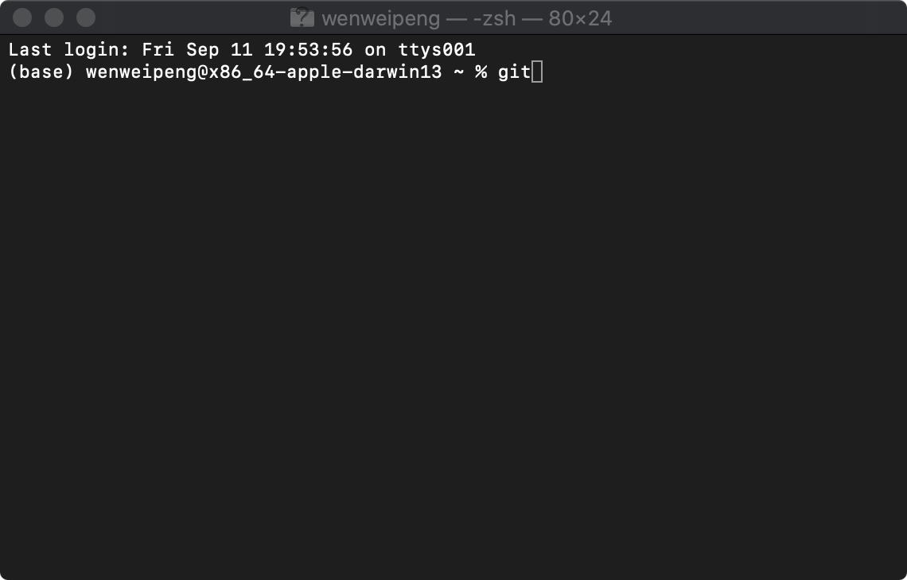
		* c) If you see this, means git is successfully installed 
		  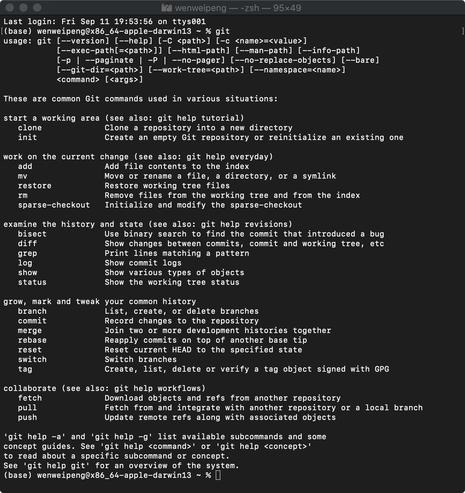
		* c) type "conda info" on the terminal
		  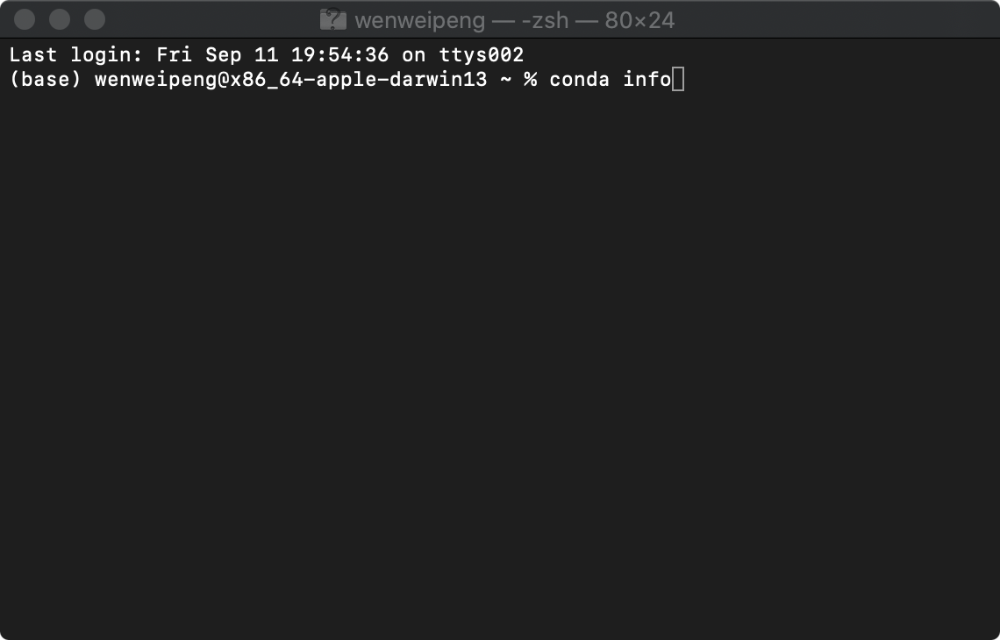
		* c) hit enter/return key, If you see this, means anaconda is successfully installed 
		  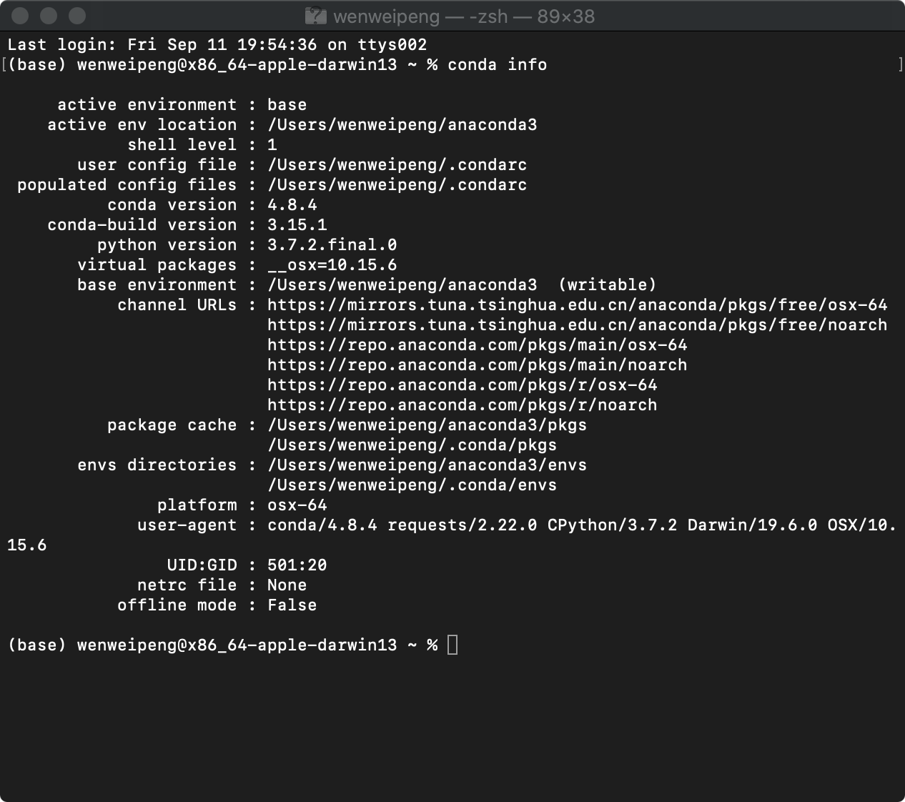

	+ 2) For Windows users:                
		
		* a) search "anaconda prompt" in the search box, and open it. 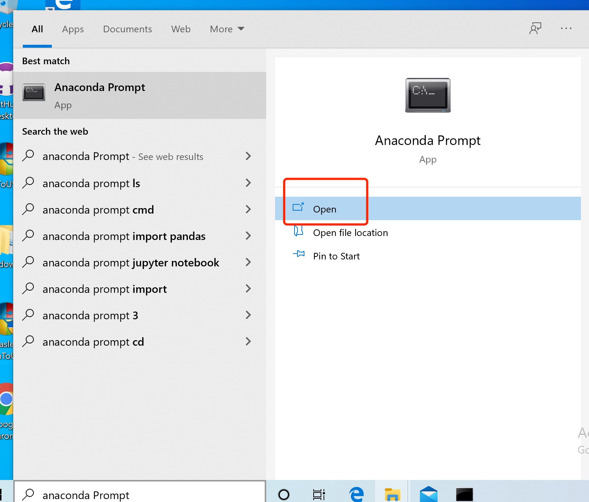
		             
		* b) type "git", and hit enter/return key 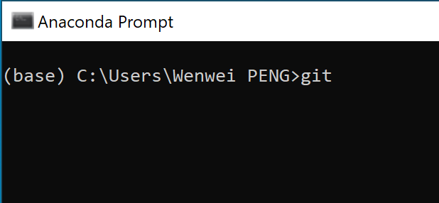

		* c) If you see this, means git is successfully installed  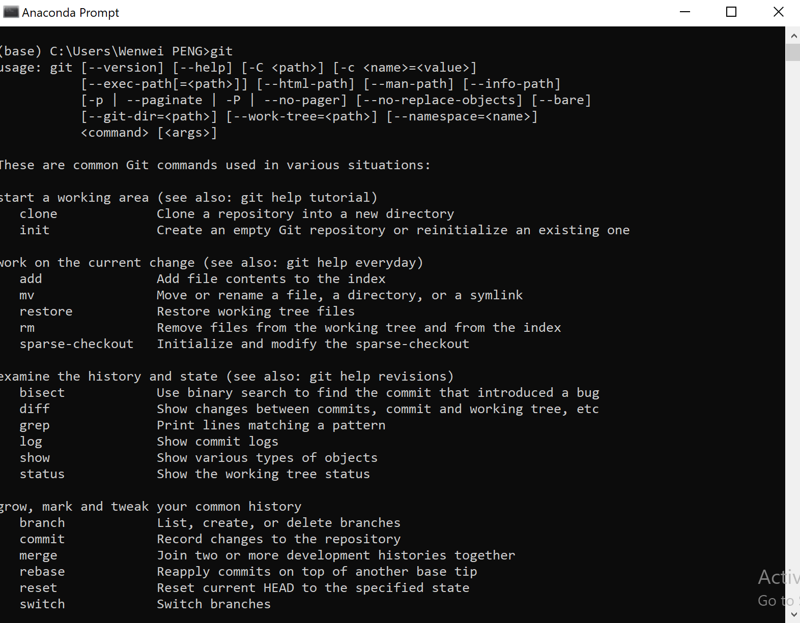
		
		* d) type "conda info" on the terminal 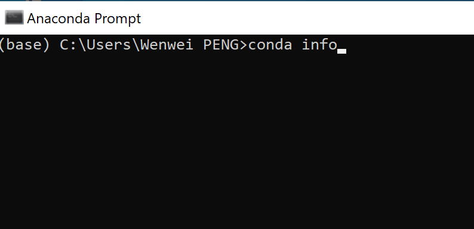
		
		* e) hit enter/return key, If you see this, means anaconda is successfully installed  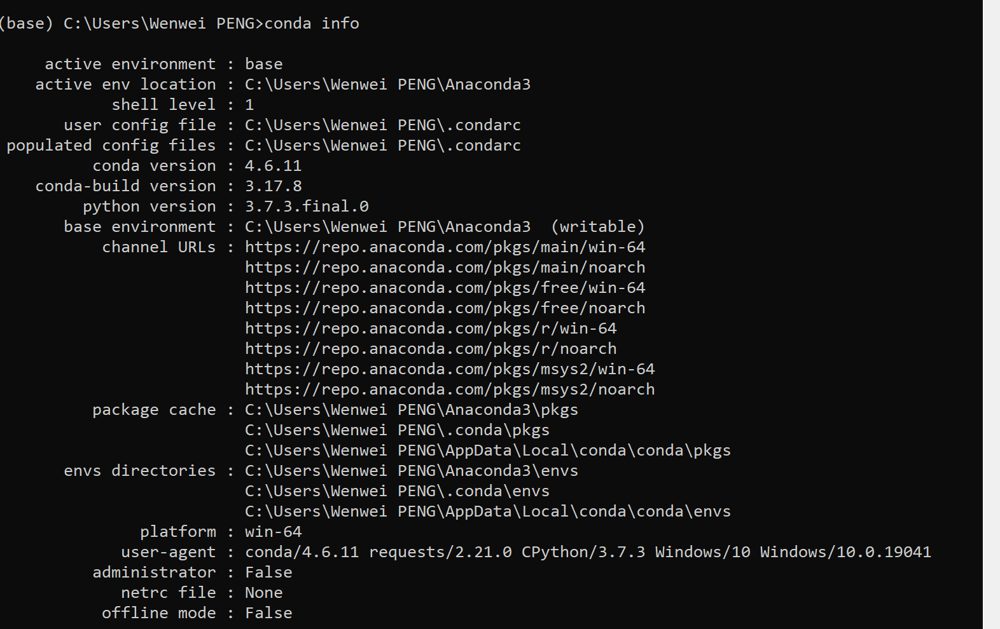

### Next tutorial

Next week, I'll cover some basics of HTML and Python.If you have any questions, please pin me on Github by opening new issues.